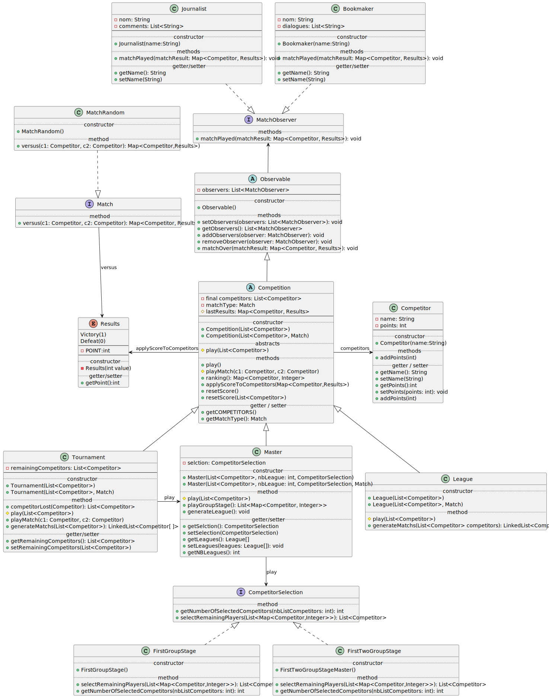

Flahaut Steeven

Righetti Massimiliano

# Sport Competition

[[_TOC_]]

## Description

The objective of the project is to create a sports competition.
It requires to support multiple types of competition as well as a way to add more types of match.


## How to

### Retrieve the project

- without SSH

```bash
git clone https://gitlab-etu.fil.univ-lille.fr/steeven.flahaut.etu/flahaut-righetti-coo.git
```

- with SSH

```bash
git clone git@gitlab-etu.fil.univ-lille.fr:steeven.flahaut.etu/flahaut-righetti-coo.git
```

### Generation of the documentation

- without make:
```bash
javadoc -classpath src -d docs sportsCompetition sportsCompetition.competition sportsCompetition.competitorSelection sportsCompetition.exception sportsCompetition.match sportsCompetition.util sportsCompetition.observer
```
- with make:
```bash
make docs
```
The documentation is located in `./docs/index.html`

### Compilation

- without make:
```bash
javac -classpath src -d classes src/sportsCompetition/*.java
```
- with make:
```bash
make class
```

### Generation of `.jar`

- without make:
```bash
jar cvfe ./appli.jar sportsCompetition.Main -C classes .
```
- with make:
```bash
make jar
```

### Tests

#### Test compilation

- without make:
```bash
javac -d classes -classpath ./lib/junit-platform-console-standalone-1.9.0.jar ./src/sportsCompetition/*.java ./src/sportsCompetition/util/*.java ./src/sportsCompetition/competition/*.java ./src/sportsCompetition/competitorSelection/*.java ./src/sportsCompetition/exception/*.java ./src/sportsCompetition/match/*.java ./src/sportsCompetition/observer/*.java ./test/sportsCompetitionTest/*.java ./test/sportsCompetitionTest/mock/*.java ./test/sportsCompetitionTest/competition/*.java ./test/sportsCompetitionTest/competitorSelection/*.java
```
- with make:
```bash
make testCompilation
```

#### Test execution

- without make:
```bash
java -jar ./lib/junit-platform-console-standalone-1.9.0.jar -cp classes --scan-classpath --disable-banner
```
- with make:
```bash
make test
```

### Execution

#### Without `.jar`
- without make:
```bash
java -classpath classes sportsCompetition.Main
```
- with make:
```bash
make launch
```

#### With `.jar`

[generate the .jar here](#generation-of-.jar)
- without make:
```bash
java -jar appli.jar
```
- with make:
```bash
make launchJAR
```

### Clean the project folder

```bash
make clean
```

## Key aspects


## UML



### Links
- [uml.svg](./uml/uml.svg)
- [uml.puml](./uml/uml.puml)
